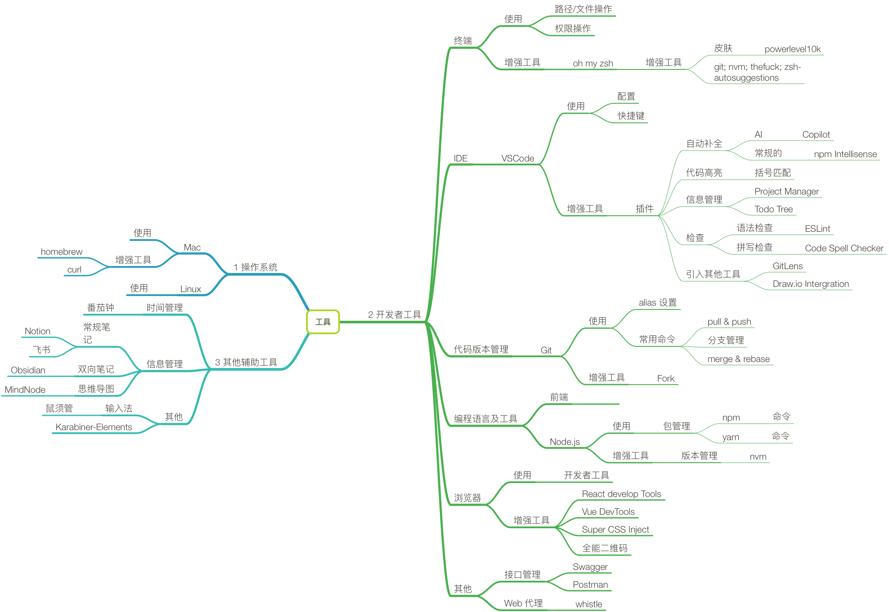

# 工具
> 工欲擅其事，比先利其器

选择合适的工具。然后是好用工具。

## 合适的工具
最基本的：能完成任务。

进阶：高效的完成任务。体现：
1. 易用。用起来很直觉，没有心智负担。
2. 自动化。
   1. 模板：信息模板，工作流模板。
   2. 工作流。
      1. 事件触发。
      2. 时间触发。
3. 可拓展性。
4. 运行速度。

## 工具列表
1. 操作系统
   1. Mac。
   2. Linux。
2. 开发者工具
   1. 终端。
   2. IDE。
   3. 代码版本管理。
   4. 编程语言及工具。
      1. 前端
      2. Node.js
   5. 浏览器。
3. 其他辅助工具
   1. 信息管理。
   2. 时间管理。
